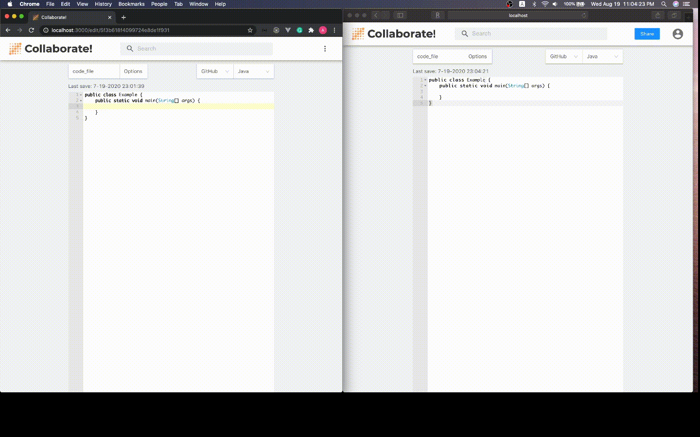
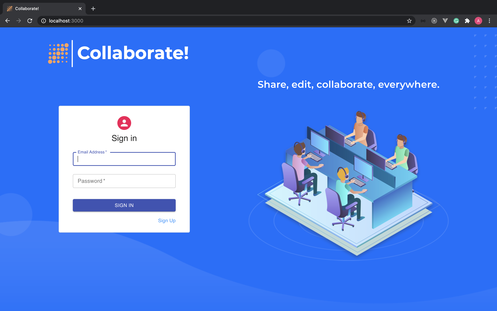
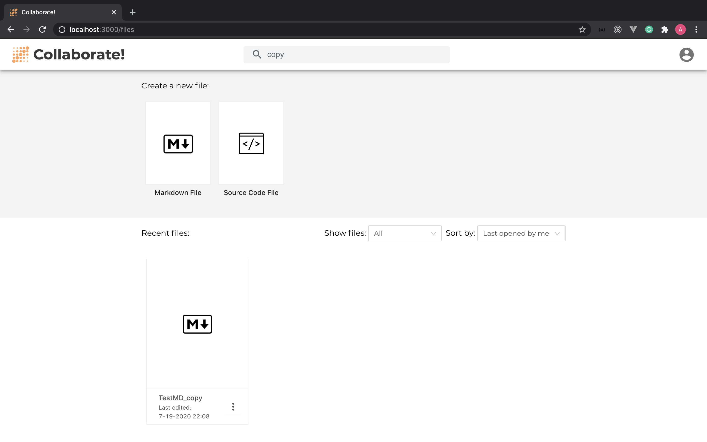
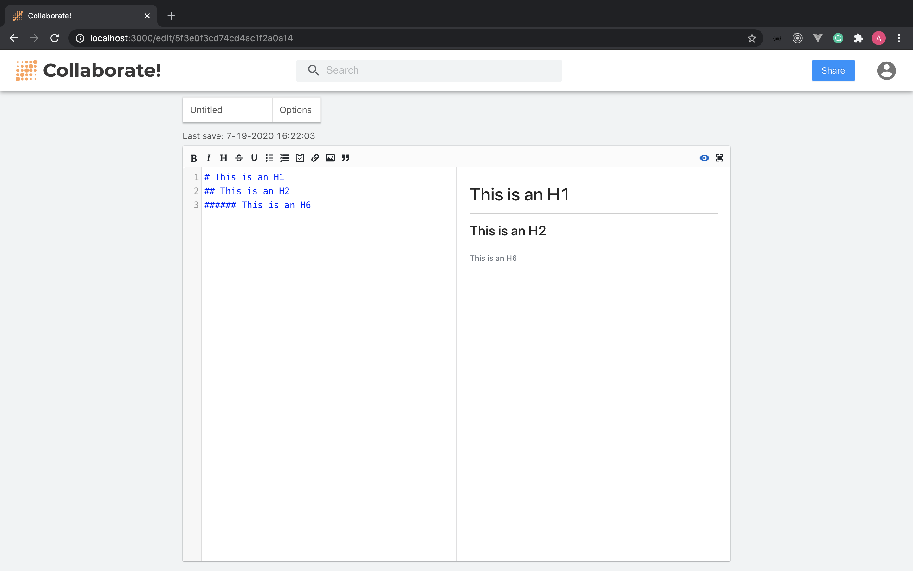
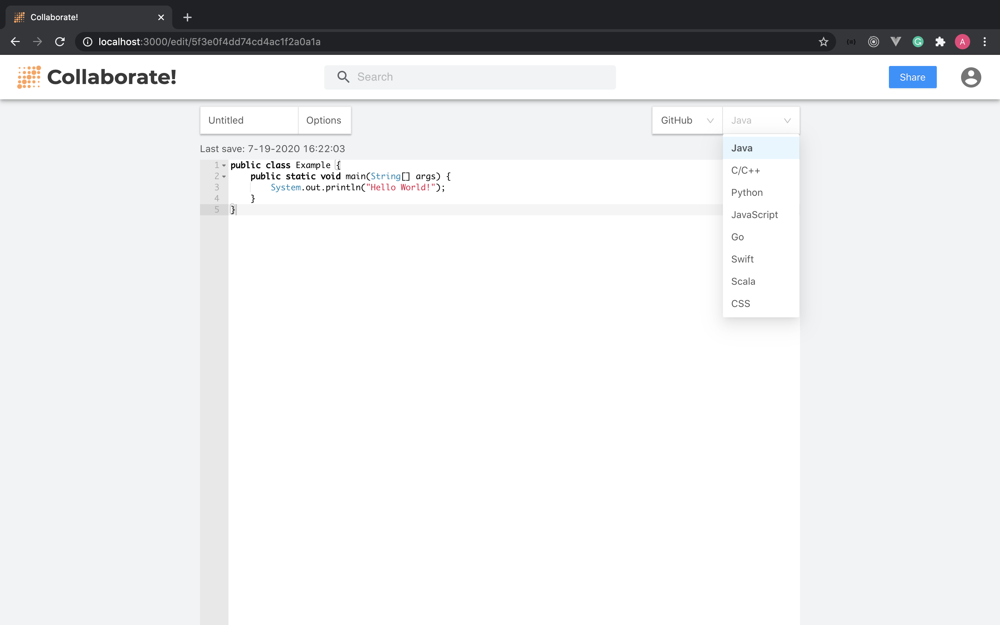
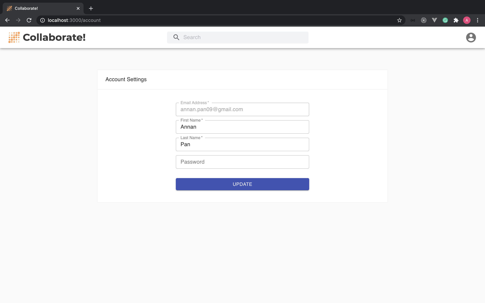

# Collaborate!

A web-based collaborative markdown and source code editor.

If you like this project, please give a star or fork it.

## Something about this project

Used React and Redux to build the front end.

Used Express, Mongoose and MongoDB to build the back end.

Built Connection between front end and back end.

Markdown editor and code editor are open source projects, credits to their authors.

Links to the markdown editor and code editor I used:

- [react-markdown-editor](https://github.com/uiwjs/react-markdown-editor)
- [react-ace](https://github.com/securingsincity/react-ace)

## To do

- [ ] Add a list of users who are editing one file in edit page

- [ ] Add file download function

## How you run this app

This repo contains front end and back end of this app

- `client` - A single-page web application built with React
- `server` - APIs built with Express

Please use `npm` to run two parts separately

## Demo

- [Collaborate!](https://collaborate-ui.herokuapp.com)

## Previews

